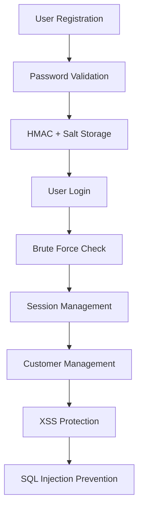

# 🛡️ Communication LTD - Cybersecurity Final Project

   

## 🌟 **Project Overview**

**Communication LTD** is a comprehensive cybersecurity project that demonstrates both **secure web development practices** and common **web vulnerabilities**. This Django-based web application simulates a telecommunications company's customer management system with advanced security features.

---

## 📋 **Table of Contents**

- [🎯 Features](#-features)
- [🏗️ Architecture](#️-architecture)
- [🚀 Quick Start](#-quick-start)
- [🔐 Security Features](#-security-features)
- [📖 Detailed Setup](#-detailed-setup)
- [🎮 Usage Guide](#-usage-guide)
- [🧪 Testing Security](#-testing-security)
- [📚 API Documentation](#-api-documentation)
- [🛠️ Technology Stack](#️-technology-stack)

---

## 🎯 **Features**

### 🔐 **Security Features**
- **Advanced Password Policy** with configurable complexity requirements
- **HMAC + Salt** encryption for password storage
- **Password History Management** (prevents reuse of last 3 passwords)
- **Brute Force Protection** with account lockout mechanism
- **Secure Password Reset** using SHA-1 hashed tokens
- **Input Validation** and **XSS Protection**
- **CSRF Protection** on all forms
- **Session Management** with automatic logout

### 📊 **Business Features**
- **User Registration & Authentication**
- **Customer Management System**
- **Email Integration** for password recovery
- **User & Customer Listing**
- **Real-time Security Monitoring**

### 🚨 **Security Demonstrations**
- **Stored XSS Attack** examples and mitigation
- **SQL Injection** vulnerabilities and prevention
- **Before/After** security implementations
- **Live Attack Demonstrations**

---

## 🏗️ **Architecture**

```
computer-security-secured/   # Project root directory (appears to be a Django project)
|-- communication_ltd/       # Main Django project settings directory
|   |-- __init__.py
|   |-- asgi.py
|   |-- config.json          # Additional configuration file
|   |-- settings.py          # Main Django settings
|   |-- urls.py              # Main URL configurations
|   +-- wsgi.py
|-- db.sqlite3               # SQLite database file
|-- mainapp/                 # Primary Django application
|   |-- __init__.py
|   |-- apps.py              # App configuration file
|   |-- migrations/          # Database schema changes (migrations)
|   |   |-- 0001_initial.py  # Initial migration to create tables
|   |   +-- __init__.py
|   |-- models.py            # Database model definitions
|   |-- static/              # Static files (CSS, JS, images, etc.)
|   |   +-- mainapp_static/  # App-specific directory within static
|   |       +-- style.css    # CSS style file
|   |-- templates/           # Template files (HTML)
|   |   +-- mainapp/         # App-specific directory within templates
|   |       |-- add_customer.html
|   |       |-- base.html          # Base template (possibly includes navigation, etc.)
|   |       |-- customer_list.html
|   |       |-- forgot_password.html
|   |       |-- home.html
|   |       |-- login.html
|   |       |-- register.html      # Registration template
|   |       |-- reset_password.html
|   |       |-- system.html        # Template related to the "system" (possibly displays info from it)
|   |       |-- user_list.html     # User list template
|   |       +-- verify_reset_code.html
|   |-- tests.py             # Test file
|   |-- urls.py              # URL configurations for the mainapp
|   +-- views.py             # Logic file (views) for mainapp
|-- manage.py                # Django management script
|-- requirements.txt         # Requirements file (libraries and packages required for the project)
+-- system/                  # Additional Django application named "system"
    |-- __init__.py
    |-- admin.py             # Django admin interface settings for the system app
    |-- apps.py              # App configuration for the system app
    |-- migrations/          # Database schema changes for the system app
    |   +-- __init__.py      # (Currently no specific migrations like 0001_initial.py)
    |-- models.py            # Database model definitions for the system app
    +-- tests.py             # Test file for the system app
```

### **🔗 System Flow**


---

## 🚀 **Quick Start**

### **⚡ 1-Minute Setup**
```bash
# Clone the repository
git clone https://github.com/100adim/computer-security-secured
cd computer-security-secured

# Setting Up a Virtual Environment
python -m venv venv
source venv/bin/activate  # macOS/Linux
venv\Scripts\activate  # Windows

# Install dependencies
pip install -r requirements.txt

# Initialize database
python manage.py makemigrations mainapp
python manage.py migrate

# Run the secure application
python manage.py runserver
```

**🌐 Access:** http://localhost:8000

---

## 🔐 **Security Features**

### **🔑 Password Security**
Our password system implements enterprise-grade security:

```json
{
  "password_min_length": 10,
  "require_uppercase": true,
  "require_lowercase": true,
  "require_numbers": true,
  "require_special": true,
  "forbidden_words": ["password", "1234", "admin"],
  "max_login_attempts": 3,
  "password_history_count": 3,
  "password_validity_days": 90
}
```

#### **🛡️ Implementation Highlights:**
- **HMAC-SHA256** with unique salt per user
- **Configurable complexity** via `config.json`
- **Dictionary attack prevention**
- **Password history** tracking (3 generations)
- **Account lockout** after failed attempts

### **🔒 Authentication Flow**
```python
# Secure password hashing
salt = os.urandom(16)
password_hash = hmac.new(salt, password.encode(), hashlib.sha256).hexdigest()

# Brute force protection
if attempts >= max_attempts:
    lock_until = now + timedelta(minutes=30)
```

### **📧 Password Recovery**
- **SHA-1 hashed** recovery tokens
- **Email verification** process
- **Time-limited** reset codes
- **Secure token generation**

---

### **💉 SQL Injection Demonstrations**

#### **Attack Examples:**
```sql
-- Login Bypass
Username: admin' OR '1'='1' --
Password: anything

-- Data Extraction
Username: admin'; SELECT * FROM mainapp_user; --

-- Data Destruction
Username: test'; DROP TABLE mainapp_user; --
```

#### **🛡️ Mitigation Techniques:**
```python
# ❌ Vulnerable (Raw SQL)
query = f"SELECT * FROM users WHERE username = '{username}'"

# ✅ Secure (Parameterized)
User.objects.get(username=username)  # Django ORM
# OR
cursor.execute("SELECT * FROM users WHERE username = %s", [username])
```

### **🚨 XSS Attack Demonstrations**

#### **Stored XSS Examples:**
```html
<!-- Attack Payload -->
<script>alert('XSS Attack!');</script>

<svg onload="document.location='http://attacker.com'">
```

#### **🛡️ XSS Prevention:**
```python
# ❌ Vulnerable
first_name = request.POST.get("first_name", "")

# ✅ Secure
first_name = html.escape(request.POST.get("first_name", ""))
```

---

## 📖 **Detailed Setup**

### **🔧 Prerequisites**
- **Python 3.8+**
- **Django 5.2**
- **SQLite** (included)
- **Email Account** for SMTP (Gmail recommended)

### **📥 Installation Steps**

#### **1. Environment Setup**
```bash
# Create virtual environment (recommended)
python -m venv venv

# Activate virtual environment
# Windows:
venv\Scripts\activate
# Mac/Linux:
source venv/bin/activate

# Install dependencies
pip install -r requirements.txt
```

#### **2. Database Configuration**
```bash
# Create migrations
python manage.py makemigrations mainapp

# Apply migrations
python manage.py migrate

# (Optional) Create superuser
python manage.py createsuperuser
```

#### **3. Email Configuration**
Update `settings.py` with your SMTP settings:
```python
EMAIL_HOST = 'smtp.gmail.com'
EMAIL_PORT = 587
EMAIL_USE_TLS = True
EMAIL_HOST_USER = 'your-email@gmail.com'
EMAIL_HOST_PASSWORD = 'your-app-password'
```

#### **4. Security Configuration**
Customize `communication_ltd/config.json`:
```json
{
  "password_min_length": 10,
  "require_uppercase": true,
  "require_lowercase": true,
  "require_numbers": true,
  "require_special": true,
  "forbidden_words": ["password", "1234", "admin", "Password"],
  "max_login_attempts": 3,
  "password_history_count": 3,
  "password_validity_days": 90
}
```

---

## 🎮 **Usage Guide**

### **🌟 User Journey**

#### **1. 📝 Registration Process**
1. Navigate to `/register/`
2. Enter username, email, and password
3. Password validation occurs in real-time
4. Account created with secure HMAC+Salt storage

#### **2. 🔐 Login Process**
1. Go to `/login/`
2. Enter credentials
3. Brute force protection activates after 3 failed attempts
4. Successful login redirects to system dashboard

#### **3. 🏠 System Dashboard**
- View welcome message
- Access customer management
- Change password functionality
- View user/customer lists

#### **4. 👥 Customer Management**
1. Click "Add Customer"
2. Enter customer details
3. XSS protection prevents malicious scripts
4. Customer appears in system with confirmation

#### **5. 🔑 Password Recovery**
1. Click "Forgot Password" on login page
2. Enter username
3. Check email for SHA-1 reset code
4. Enter code and set new password

---

## 🧪 **Testing Security**

### **🔍 Security Testing Scenarios**

#### **Test 1: Password Complexity**
```bash
# Test weak passwords
Password: "123456789"          # ❌ No uppercase/special
Password: "password123!"       # ❌ Contains forbidden word
Password: "TempPass1!"         # ✅ Meets all requirements
```

#### **Test 2: Brute Force Protection**
1. Try logging in with wrong password
2. Attempt 3 times quickly
3. Account should lock for 30 minutes
4. Verify lockout message appears

#### **Test 3: XSS Prevention (Secure Version)**
```html
<!-- Enter in customer name field -->
<script>alert('XSS Test')</script>

<!-- Expected result: Script displayed as text, not executed -->
```

#### **Test 4: SQL Injection Prevention (Secure Version)**
```sql
-- Try in login username field
admin' OR '1'='1' --

-- Expected result: "Invalid characters in username"
```

---

## 📚 **API Documentation**

### **🔗 Main Endpoints**

| Method | Endpoint | Description | Security Features |
|--------|----------|-------------|------------------|
| `GET` | `/` | Home dashboard | Session validation |
| `POST` | `/register/` | User registration | Password complexity, XSS protection |
| `POST` | `/login/` | User authentication | Brute force protection, input validation |
| `POST` | `/add_customer/` | Add new customer | XSS protection, SQL injection prevention |
| `GET` | `/customer_list/` | View customers | XSS-safe output escaping |
| `POST` | `/forgot_password/` | Password recovery | SHA-1 token generation |
| `POST` | `/reset_password/` | Password reset | Password history validation |
| `GET` | `/logout/` | Session termination | Secure session cleanup |

### **🔒 Security Headers**
```python
# CSRF Protection


# XSS Prevention
{{ user_input|escape }}

# SQL Injection Prevention
User.objects.get(username=username)  # Parameterized queries
```

---

## 🛠️ **Technology Stack**

### **🔧 Backend Technologies**
- **Django 5.2** - Web framework
- **Python 3.8+** - Programming language
- **SQLite** - Database
- **HMAC-SHA256** - Password hashing
- **SHA-1** - Password reset tokens

### **🎨 Frontend Technologies**
- **HTML5** - Markup
- **CSS3** - Styling
- **Django Templates** - Server-side rendering
- **Bootstrap** (Optional) - UI components

### **🔐 Security Libraries**
- **hashlib** - Cryptographic hashing
- **hmac** - HMAC implementation
- **html** - XSS prevention
- **re** - Input validation
- **os.urandom** - Secure random generation

### **📧 Email Integration**
- **django.core.mail** - Email functionality
- **SMTP** - Email protocol
- **Gmail SMTP** - Email service

---

## 🚀 **Deployment**

### **🌐 Local Development**
```bash
python manage.py runserver 0.0.0.0:8000
```

---
